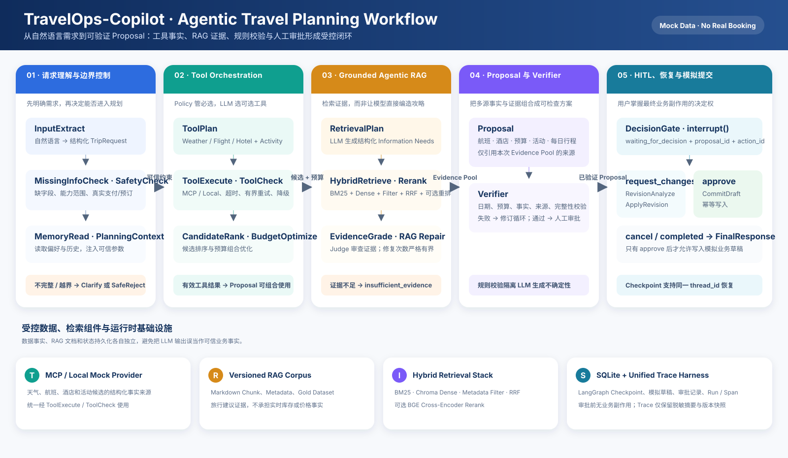

# TravelOps-Copilot

TravelOps-Copilot 是一个面向**模拟旅行规划**场景构建的 Agentic Workflow 项目。它不是一次 LLM 调用生成一段旅游文案的 Demo，而是将旅行规划拆分为可验证、可审计、可恢复、可人工介入的状态机工作流。

系统从自然语言请求中提取旅行约束，调用天气、航班、酒店与活动工具，检索可追溯的旅行知识证据，生成并校验旅行 Proposal，并在真正产生业务副作用之前交由用户确认。

> **定位：** 用受控的 Mock 数据、Agentic RAG、Tool Orchestration、Verifier 和 Human-in-the-loop，演示一个“知道何时应继续、何时应澄清、何时应停止”的旅行规划 Agent。

## 为什么不是普通旅行问答 Demo

一个看似合理的旅行答案，并不意味着它基于可信事实，也不意味着系统正确处理了失败、修改和审批。本项目将这些职责显式拆开：

| 问题 | TravelOps-Copilot 的处理方式 |
| --- | --- |
| 用户输入不完整怎么办？ | <code>MissingInfoCheck</code> 返回澄清，不擅自补全出发地、日期或预算。 |
| 用户要求真实预订、付款或出票怎么办？ | <code>SafetyCheck</code> 进入 <code>SafeReject</code>，不调用真实交易服务。 |
| 航班、酒店、天气和活动从哪里来？ | 使用 MCP / Local Mock Provider 的结构化工具事实，不让 LLM 虚构。 |
| 旅行建议为什么可信？ | Agentic RAG 检索版本化 Guides / Hotel Reviews，并由 <code>EvidenceGrade</code> 审查。 |
| LLM 生成的 Proposal 有错误怎么办？ | <code>Verifier</code> 校验日期、预算、候选事实、来源引用和完整性。 |
| 用户想修改方案怎么办？ | 同一 <code>thread_id</code> 从 LangGraph Checkpoint 恢复，进入 Revision Loop。 |
| 什么时候可以写入旅行草稿？ | 仅在 Verifier 通过且用户明确 <code>approve</code> 后，由 <code>CommitDraft</code> 幂等写入模拟业务数据。 |

## 核心能力

- **单一 PlanTrip StateGraph：** 覆盖规划、澄清、安全拒绝、RAG Repair、Proposal Repair、审批、修改和取消分支。
- **结构化旅行需求提取：** 提取出发地、目的地、日期、预算、酒店偏好和活动偏好，并做能力范围检查。
- **三段式工具编排：** ToolPlan → ToolExecute → ToolCheck 统一处理工具选择、执行、超时、有界重试、校验和降级。
- **Policy + LLM Tool Calling：** 天气、往返航班、酒店由 Policy 强制；活动工具由 LLM 根据用户显式偏好从工具注册表中选择。
- **Agentic RAG：** RetrievalPlan → HybridRetrieve → Rerank → EvidenceGrade 将检索需求、证据和最终 Proposal 解耦。
- **Grounded Proposal：** 将工具事实、候选排序、预算、活动候选和 RAG Evidence Pool 组合为逐日旅行方案。
- **Verifier + HITL：** Proposal 必须先通过校验，再进入 DecisionGate 等待用户 approve、request_changes 或 cancel。
- **安全的持久化边界：** 审批前不写入业务草稿；审批后以稳定 decision_event_id 执行幂等模拟提交。
- **可观测性与评测：** 提供 Unified Trace Harness、RAG Eval、Workflow Eval 和 342 项 pytest 回归。

## 工作流说明

~~~text
用户请求
  -> InputExtract
  -> MissingInfoCheck --缺字段 / 超出 Mock 范围--> Clarify -> FinalResponse
  -> SafetyCheck --真实预订 / 支付等越界请求--> SafeReject -> FinalResponse
  -> MemoryRead -> PlanningContext
  -> ToolPlan (Policy 必选工具 + LLM 可选活动工具)
  -> ToolExecute -> ToolCheck
  -> CandidateRank -> BudgetOptimize
  -> RetrievalPlan -> HybridRetrieve -> Rerank -> EvidenceGrade
  -> Proposal -> Verifier
  -> DecisionGate interrupt()
       -> approve         -> CommitDraft -> FinalResponse
       -> request_changes -> RevisionAnalyze -> ApplyRevision -> MissingInfoCheck
       -> cancel          -> Cancel -> FinalResponse
~~~

### 各层职责边界

| 层级 | 主要职责 | 不承担的职责 |
| --- | --- | --- |
| 结构化工具层 | 提供天气、航班、酒店和活动候选等受控事实。 | 不生成最终逐日旅行行程。 |
| RAG 层 | 提供目的地、文化、景点、饮食、活动偏好等补充知识证据。 | 不要求某个 Chunk 预先包含完整 N 日旅行方案。 |
| EvidenceGrade | 判断 RAG Evidence Pool 是否支持必需 Information Need。 | 不将未经建模的工具候选自动当作 RAG 证据。 |
| Proposal 层 | 将多条工具事实与多条证据组合成最终的 N 日行程。 | 不绕过 Verifier 或用户审批直接提交。 |
| Verifier 层 | 校验 Proposal 的预算、日期、事实、引用和完整性。 | 不以“看起来合理”替代规则校验。 |
| HITL / Persistence 层 | 支持暂停、恢复、修改、取消和批准后的幂等保存。 | 不在用户批准前产生业务副作用。 |

## 技术栈

### Agent 与工作流

- **LangGraph：** 构建条件路由、状态恢复、RAG Repair、Revision Loop 和 interrupt() 人工审批。
- **LangChain Core：** 组织 LLM Message、原生 Tool Calling 和结构化输出。
- **DeepSeek：** 用于自然语言提取、可选工具选择、Retrieval Planner 和 Evidence Judge；关键工作流路由另有 Schema、Policy 和确定性校验保护。

### API、状态与持久化

- **Python + FastAPI：** 提供启动、状态查询、Checkpoint 历史和 HITL Resume API；同时以同源方式提供轻量 Web UI。
- **Pydantic / Pydantic Settings：** 定义旅行请求、工具计划、Information Need、Evidence Grade、Proposal 与审批 Schema，并统一配置管理。
- **SQLAlchemy + SQLite：** 保存用户、偏好、旅行历史、模拟草稿、版本和审批审计记录。
- **SQLite Checkpointer：** 与业务数据库分离，保存 LangGraph State、执行位置和人工中断恢复信息。

### Tools、MCP 与 RAG

- **MCP stdio Client / Server：** 统一封装天气、航班、酒店等数据调用，并可切换 Local / MCP Client。
- **版本化 Mock Provider：** 使用可复现的天气、航班、酒店、活动 Mock 数据，而不是伪装成实时旅行服务。
- **BM25 + jieba：** 中文关键词与精确词项检索。
- **Chroma + Sentence Transformers：** Dense Retrieval 与 Metadata Filter。
- **Reciprocal Rank Fusion（RRF）：** 融合 BM25 与 Dense Retrieval 排名。
- **BGE Cross-Encoder：** 作为可选的高质量二阶段 Reranker。
- **Agentic Evidence Grade：** 以结构化 Information Need、成功条件、证据引用和有界 Repair 约束 RAG 流程。

### 测试、评测与可观测性

- **pytest / httpx：** 单元、节点、API、RAG、Workflow 和 Eval 回归测试。
- **RAG Eval：** 手工标注 Gold Case、正负例、Metadata 检查、四组检索消融和 Bad Case 分析。
- **Workflow Eval：** 通过确定性替身验证路由、工具、Verifier、HITL、Revision 和 Commit 幂等性。
- **Unified Trace Harness：** 为每次 start / resume 生成 run_id，记录 Run / Node / Tool / MCP Span 的脱敏摘要、错误码、耗时和版本快照。

## 当前受控范围

当前版本是一个受控数据边界下的旅行规划系统：

| 项目 | 当前支持 |
| --- | --- |
| 城市 | 杭州、北京、上海。 |
| 日期 | 2026-10-01 至 2026-10-07。 |
| 行程 | 单目的地往返、连续日期、全程一家酒店、最长 7 天。 |
| 航线 | 三城两两双向的版本化 Mock 航班数据。 |
| 偏好 | 文化、博物馆、展览、街区、美食、夜间、亲子、低步行、室内活动等。 |
| 交互 | Proposal 审阅、批准、修改、取消、Checkpoint 恢复。 |

### 明确非目标

- 真实机票、酒店库存、实时价格、开放时间和运营状态；
- 真实预订、支付、出票、退款、通知发送；
- 多城市串联、多段航班、每天换酒店、多人独立画像；
- 生产级 Replay 平台、Time Travel UI 或完整 AgentOps 平台；
- 将 RAG 文档当作实时价格、库存或运营状态来源。

系统只生成和保存 <code>approved_simulated</code> 模拟旅行草稿，绝不会声称已完成真实预订、付款或出票。

## 已知证据边界：日期敏感活动

当前系统刻意区分 Tool 事实与 RAG 证据：

~~~text
活动工具
  -> 返回按城市、日期和偏好筛选的结构化候选
  -> ToolCheck 验证工具结果
  -> Proposal 可以使用候选安排日程

EvidenceGrade
  -> 只审查 RAG 的静态 evidence_pool
  -> 判断静态 RAG 是否支持必需 Information Need
~~~

因此，如果用户将“限时活动”等日期敏感内容设为**必需条件**，而版本化 Guides 语料中没有对应静态证据，系统会保守返回 <code>insufficient_evidence</code>，而不是删减用户需求、放宽证据条件或编造活动。

这不是活动工具执行失败，而是当前版本中“跨来源 Information Need 由 ToolCheck 证明还是由 EvidenceGrade 证明”尚未统一建模的职责边界。未来如需演进，应通过结构化 Need 的证据来源归属解决，而不是以自然语言理由匹配或降低 RAG Judge 门槛绕过审查。

详见 [项目范围](docs/project_scope.md)、[当前设计](docs/current_design.md) 和 [架构说明](docs/architecture.md)。

## RAG Eval：检索质量、代价与结论

RAG Eval 使用生产检索组件，而不是独立 Demo Retriever。当前评测语料为 <code>v5-agentic-challenge</code>，包含 **222 个 Chunk**。评测拆分为两个职责明确的数据集：

- **Scope Regression Set：** 108 条（84 条正例、24 条负例），验证每类版本化证据是否可检索、Metadata Filter 是否 fail-closed。安全类每条查询以多 Gold 表达完整风险证据，避免同一查询对应互斥单 Gold 的错误标注。
- **Semantic Holdout Set：** 42 条（39 条正例、3 条负例），用于真实表达、多偏好、含蓄需求、语义干扰与 need-level 拆分评估；它不以文档章节标题复述作为主要查询形式。

Scope Regression Set 的完整四组 MiniLM 消融在本地 CPU 环境运行，启动时间不计入单查询延迟：

| Variant | Hit@5 | Recall@5 | MRR@5 | nDCG@5 | Metadata | Negative accuracy | P95 |
| --- | ---: | ---: | ---: | ---: | ---: | ---: | ---: |
| BM25 only | 1.0000 | 0.9940 | 0.9464 | 0.9586 | 1.0000 | 1.0000 | 33.61 ms |
| Vector only | 1.0000 | 0.9881 | 0.9524 | 0.9555 | 1.0000 | 1.0000 | 32.88 ms |
| BM25 + Vector + RRF | 1.0000 | 0.9940 | 0.9504 | 0.9618 | 1.0000 | 1.0000 | 49.86 ms |
| Hybrid + BGE Rerank | 1.0000 | 0.9940 | 0.9563 | 0.9626 | 1.0000 | 1.0000 | 4326.68 ms |

完整实验口径、候选池诊断和失败 Case 见 [MiniLM Scope Regression Report](eval/rag_report.md)、[MiniLM Semantic Holdout Report](eval/rag_challenge_report.md) 与 [Bad Case Registry](eval/rag_bad_cases.md)。可分别运行：

~~~powershell
python -m eval.run_rag_eval --suite scope_regression
python -m eval.run_rag_eval --suite semantic_holdout
~~~

### Embedding 模型对比：MiniLM 与 BGE Base 中文版

两次实验固定了语料、Chunking、Gold Case、Metadata Filter、Top-K、RRF、Reranker 和 `v2_metadata_enriched` Embedding 文本，只替换 Dense Embedding 模型。MiniLM 为 `paraphrase-multilingual-MiniLM-L12-v2`；BGE 为本地下载的 `BAAI/bge-base-zh-v1.5`。模型目录被 `.gitignore` 排除，仓库只保存可复现的配置、评测集和结果。

| Suite / Variant | MiniLM Hit@5 | BGE Hit@5 | MiniLM Recall@5 | BGE Recall@5 | MiniLM MRR@5 | BGE MRR@5 | MiniLM nDCG@5 | BGE nDCG@5 | MiniLM P95 | BGE P95 |
| --- | ---: | ---: | ---: | ---: | ---: | ---: | ---: | ---: | ---: | ---: |
| Scope / Vector only | 1.0000 | 1.0000 | 0.9881 | 0.9940 | 0.9524 | 0.9405 | 0.9555 | 0.9519 | 32.88 ms | 81.70 ms |
| Scope / BM25 + Vector + RRF | 1.0000 | 1.0000 | 0.9940 | 0.9940 | 0.9504 | 0.9554 | 0.9618 | 0.9626 | 49.86 ms | 81.42 ms |
| Semantic / Vector only | 0.8205 | **1.0000** | 0.6880 | **0.9017** | 0.5252 | **0.9573** | 0.5196 | **0.8913** | 38.94 ms | 98.18 ms |
| Semantic / BM25 + Vector + RRF | 1.0000 | 1.0000 | 0.9038 | **0.9103** | 0.7201 | **0.9487** | 0.7217 | **0.9133** | 37.27 ms | 94.21 ms |
| Semantic / Hybrid + Rerank | 1.0000 | 1.0000 | **0.9338** | 0.9188 | 0.9274 | **0.9316** | **0.9049** | 0.9047 | 5436.44 ms | 5332.77 ms |

在 Scope Set 中，BGE 没有显著提升，且由于模型更大，Vector P95 从约 33 ms 增至约 82 ms；这符合该集合主要检查可达性与结构化标题定位的性质。

在真正考察自然语言泛化的 Semantic Holdout 中，BGE 的改进非常明显：Vector-only 的 Hit@5 从 0.8205 提升到 1.0000，MRR@5 从 0.5252 提升到 0.9573；Hybrid RRF 的 MRR@5 从 0.7201 提升到 0.9487。尤其是原先 MiniLM 最弱的 `split_need` 偏好检索，BGE Vector-only 已达到 Hit@5 1.0000、Recall@5 1.0000，并将 Decoy Hit@5 降至 0.3889。

加入现有 Cross-Encoder 后，两种 Embedding 的最终结果接近：MiniLM 的 Semantic Recall@5 略高（0.9338 vs 0.9188），BGE 的 MRR@5 略高（0.9316 vs 0.9274），nDCG 基本持平。它说明 BGE 主要改善的是第一阶段 Dense / Hybrid 候选质量，而 Reranker 已能补偿一部分 MiniLM 的排序缺陷。

这说明三个事实：

1. **Scope Set 与 Semantic Holdout 回答不同问题。** 前者验证版本化证据和过滤是否可达，后者才检验自然语言语义泛化，不能混为一张排行榜。
2. **Embedding 模型必须在语义 Holdout 验证。** BGE 对复杂中文偏好与语义干扰的区分能力显著优于当前 MiniLM；每次模型或输入格式变更都必须使用新的 collection / `embedding_text_version` 重新编码并重跑两套评测。
3. **Hybrid 的价值主要在候选覆盖，Reranker 的价值在最终精排。** RRF 不保证每个 Scope MRR 都超过强 BM25；在 BGE 下，Hybrid 已获得高质量候选，Cross-Encoder 对最终排名的边际增益相对变小，代价仍是 CPU 秒级 P95。

独立报告与原始机器可读结果：

- [BGE Scope Regression Report](eval/rag_bge_base_zh_v15_scope_report.md) / [JSON](eval/results/rag_bge_base_zh_v15_scope_results.json)
- [BGE Semantic Holdout Report](eval/rag_bge_base_zh_v15_semantic_report.md) / [JSON](eval/results/rag_bge_base_zh_v15_semantic_results.json)

因此本项目保留 BM25、Dense、RRF 和 Rerank 四组消融：检索策略应由固定语料、固定 Gold 和两类评测集共同决定，而不是由某一个漂亮分数决定。

> Grounded Citation Rate 不在纯 RAG Eval 中伪造数值。它必须以同一运行中的 TripProposal.sources 对照同一次 Evidence Pool 计算，否则只是在重复“检索结果来自语料库”这一无意义事实。

## Workflow Eval 与回归验证

完整测试使用项目实际 Python 3.11 环境运行：

~~~text
344 passed
~~~

Workflow Eval 使用生产 Graph 拓扑、真实 DecisionGate interrupt / resume、真实 Verifier 与 Commit 断言，并对外部依赖使用确定性替身。32 条 Case 覆盖请求提取、能力边界、工具数据、RAG、Verifier、HITL 修改和 Commit 幂等性：

| 指标 | 结果 |
| --- | ---: |
| task_success_rate | 1.0000 |
| expected_path_accuracy | 1.0000 |
| expected_tool_precision / recall | 1.0000 / 1.0000 |
| verifier_detection_recall | 1.0000 |
| verifier_false_positive_rate | 0.0000 |
| grounded_citation_rate | 1.0000 |
| no_side_effect_before_approval | 1.0000 |
| revision_merge_correctness | 1.0000 |
| commit_idempotency | 1.0000 |

完整结果见 [Workflow Eval Report](eval/workflow_report.md)。该 Harness 证明的是工作流路径、HITL 和业务副作用边界的确定性正确性，不将它表述为实时 Provider 或实时 LLM 的质量保证。

## API 与 Web UI

启动服务：

~~~powershell
python -m uvicorn app.main:app --reload
~~~

其中 python 指向已安装项目依赖的当前虚拟环境解释器。启动后访问 [http://127.0.0.1:8000/](http://127.0.0.1:8000/) 即可使用同源 Web UI。页面不依赖 Node、npm、React 或独立前端服务。

| 方法 | 路径 | 用途 |
| --- | --- | --- |
| GET | /health | 检查应用、Runtime 和当前数据客户端模式。 |
| POST | /api/v1/travel/invoke | 启动新的 PlanTrip Graph。 |
| GET | /api/v1/travel/runs/{thread_id} | 查询脱敏后的当前状态。 |
| GET | /api/v1/travel/runs/{thread_id}/history | 查询脱敏后的 Checkpoint 历史。 |
| POST | /api/v1/travel/decision/{thread_id} | 在同一 thread_id 下提交 approve、request_changes 或 cancel。 |

请求示例：

~~~json
{
  "user_id": "user_001",
  "message": "2026年10月1日从杭州到北京玩两天，多点活动。",
  "reference_date": "2026-08-25"
}
~~~

成功生成 Proposal 时，接口返回 waiting_for_decision、proposal_id 和可用审批操作。选择 request_changes 会在同一会话恢复 Graph；选择 approve 才会触发幂等的模拟草稿提交。

## 快速验证

~~~powershell
# 完整回归：在已激活的项目虚拟环境中运行
python -m pytest -q

# RAG Eval：加载本地 Embedding 与 Reranker，CPU 环境下耗时较长
python -m eval.run_rag_eval --variants A_bm25_only B_vector_only C_bm25_vector_rrf D_bm25_vector_rrf_rerank --fetch-multiplier 1

# Workflow Eval：运行 32 条确定性工作流 Case
python -m eval.run_workflow_eval
~~~

## 目录结构

~~~text
travelops-copilot/
├── app/
│   ├── api/              # FastAPI 启动、查询、审批恢复接口
│   ├── workflows/        # PlanTrip StateGraph、Runtime、Checkpoint 工具
│   ├── nodes/            # Graph 节点、工具编排、修复循环、DecisionGate 与 Commit
│   ├── mcp/              # MCP Server、Client、Client Factory
│   ├── providers/        # 版本化 Mock Provider
│   ├── rag/              # Planner、Retriever、Rerank、Evidence Grade 与 Runtime
│   ├── schemas/          # Pydantic 请求、工具、RAG、Proposal Schema
│   ├── db/               # SQLAlchemy 模型、初始化、Seed
│   └── verifiers/        # Proposal 事实、预算、引用与安全校验
├── data/
│   ├── mock/             # 天气、航班、酒店、活动 Mock 数据
│   ├── rag_docs/         # 版本化 Markdown RAG 语料
│   └── seed/             # 用户画像与旅行历史 Seed
├── docs/
│   ├── assets/           # README 架构图等可提交视觉资源
│   └── *.md              # 架构、范围、可靠性和评测说明
├── eval/                 # Gold Dataset、指标、Runner、报告与 Bad Case
├── tests/                # 单元、集成、Runtime、API、RAG 与 Eval 测试
├── requirements.txt
└── .env.example
~~~

## 配置与安全

复制 <code>.env.example</code> 为 <code>.env</code> 后配置本地运行环境。<code>.env</code>、本地模型、SQLite 数据库、LangGraph Checkpoint、Chroma 持久化目录、日志和未审计的 <code>data/staging/</code> 都被 <code>.gitignore</code> 排除，不应提交到仓库。

项目只使用 Mock 旅行数据。请不要将真实用户信息、支付信息、真实预订记录、完整 Prompt、未脱敏 Evidence Pool 或 API Key 写入数据文件、Trace、截图或 Git 历史。
